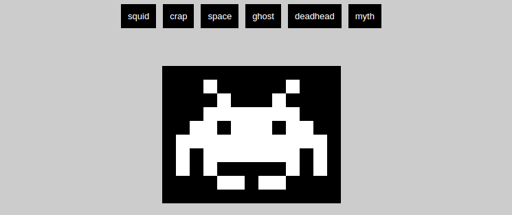

# Invader

Concevoir une application pour afficher des modeles du street artiste "Invader" s'inspirant de l'univers du pixel art et plus spécifiquement du très célèbre jeu 'Space Invaders'



## Objectifs

- Concevoir un système d’interprétation de matrice simple
- Gestion de différents type de block (couleurs via CSS)
- Positionnement absolu
- Génération des éléments de navigation via JS
- Passage de données en dataset
- Boucles imbriquées
- Encapsulation module

## Brief

Ardoise numérique de représentation de pixel art configurable :

- Les modèles de dessins doivent être exprimés en code (dans un fichier JS)
- Les tailles de pixels sont configurables
- Les types de pixels doivent être stylisables (Nous voulons pouvoir changer les couleurs à loisir)
- Il est possible de naviguer entre les dessins qui seront interprétés par l'ardoise
- L'ardoise et les modèles doivent être séparés (Nous voulons pouvoir ajouter de nouveaux modèles au catalogue sans risquer de 'casser' l'ardoise )

Pour exemple : Un modèle du catalogue

```
      'xxxxxxxxxxxxx'
      'xxx-xxxxx-xxx'
      'xxxx-xxx-xxxx'
      'xxx-------xxx'
      'xx--x---x--xx'
      'x-----------x'
      'x-x-------x-x'
      'x-x-xxxxx-x-x'
      'xxxx--x--xxxx'
      'xxxxxxxxxxxxx'
```
